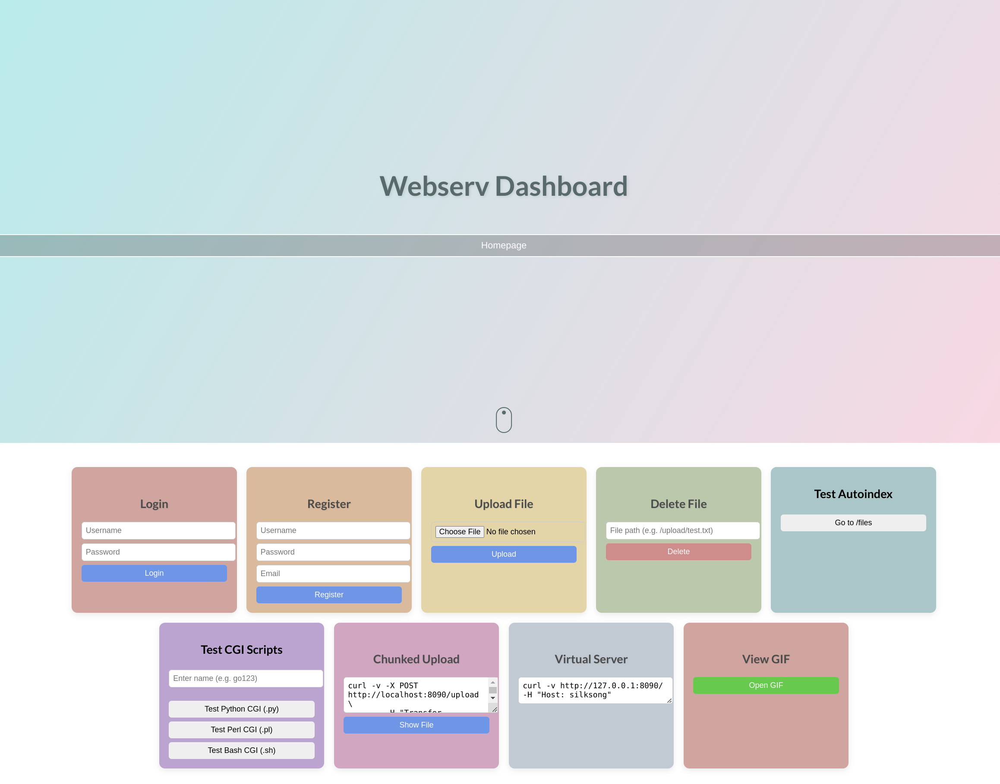

# 🌐 Webserv

### 42 Project - Non blocking IO HTTP Server in C++
##🌍Test Website Preview
##
---
<h4 align="right">
	
  🧑🏻‍💻👩🏻‍💻 Made by [@ISDouglas](https://github.com/ISDouglas) and [@yJuste](https://github.com/yJuste)  

</h4>
## 🧠 Overview

**Webserv** is a project from **42 School** that aims to implement a fully functional **HTTP server** in **C++98**, capable of serving static and dynamic web content.

The goal is to reproduce the behavior of a real web server like **nginx** or **Apache**, while deepening understanding of **sockets**, **HTTP protocols**, **CGI**, **I/O non-blocking** (using `fcntl() + O_NONBLOCK`), and **I/O multiplexing** (using `poll()`).

---

## 🚀 Features

- Fully compliant with **HTTP/1.1** specifications.  
- Supports multiple **server blocks** and **virtual hosts**.  
- **Non-blocking I/O** using `poll()` for efficient handling of multiple clients.  
- Handles:
  - `GET`, `POST`, and `DELETE` requests.
  - **Static file serving**.
  - **Directory listing (autoindex)**.
  - **CGI scripts** (e.g., PHP or Python).
- Custom **error pages** per server configuration.
- **Configuration file** parser (`.conf` format, nginx-like syntax).
- Robust **request/response parsing** and **chunked transfer encoding**.

---

## 🧩 Technologies Used

| Component | Description |
|------------|-------------|
| **Language** | C++98 |
| **Networking** | POSIX sockets |
| **I/O Multiplexing** | `poll()` |
| **I/O Non-blocking** | `fcntl() + O_NONBLOCK` |
| **Configuration** | Custom parser for `.conf` files |
| **CGI Handling** | Environment setup + process fork/exec |
| **Testing** | Using web browsers, `curl`, and `siege` (HTTP Load Tester by Jeffrey Fulmer etc.) |

---

## ⚙️ Usage

### 🧱 Compilation
```bash
make
```
## ▶️ Run the Server
```bash
./webserv conf/beast.conf
```
###Then open your browser and go to :
```bash
http://localhost:8090/
```
### 🧾 Example Configuration
```bash $cat config.conf
server {
    listen 8090;
    server_name localhost;

    root ./site;

    location / {
        index index.html;
        autoindex on;
    }

    location /cgi/ {
        root ./site/resources/cgi/;
    }

    error_page 404 /errors/404.html;
}
```

##🧪 Testing

You can test your webserver with:
```bash
curl -v http://localhost:8090/
curl -X POST -d "name=Alice&email=alice@example.com" http://localhost:8090/cgi/hub.py/others/process.py
siege -c 50 -r 20 http://localhost:8090/
```
